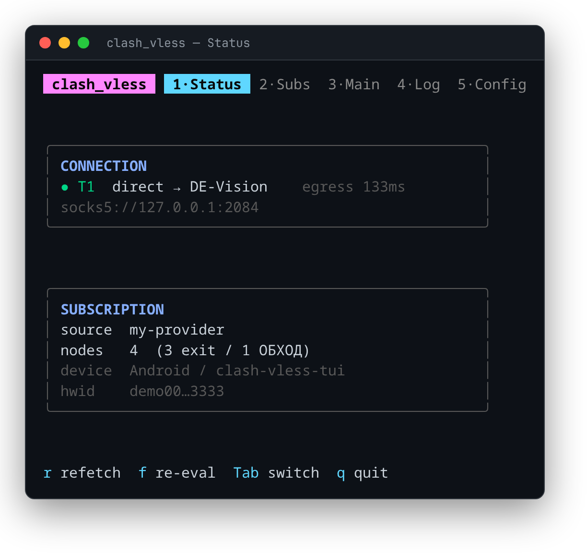
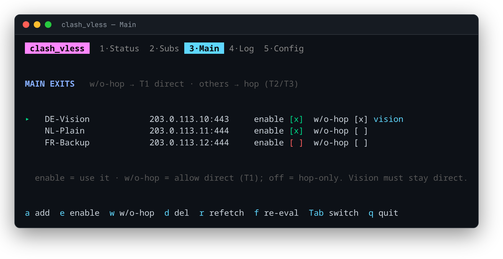
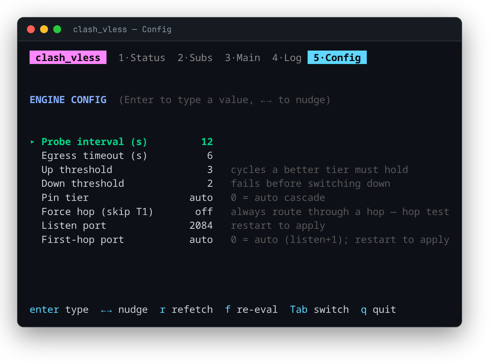
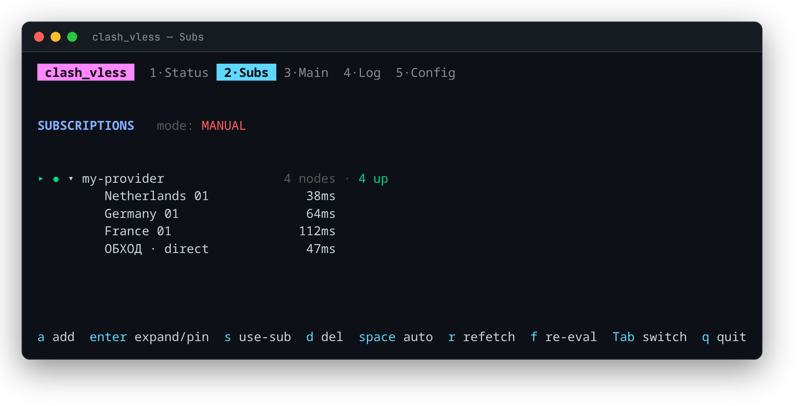

# clashvless

A single-binary Go **CLI + TUI** that manages a Happ-gated **Remnawave** subscription and keeps a
local **SOCKS5** proxy pointed at the best working exit — with automatic, tiered failover and an
embedded [xray-core](https://github.com/XTLS/Xray-core) (no external `xray` needed).

<p align="center"></p>

## What it does

- **Embedded xray-core** — the whole thing compiles to one static binary.
- **Managed exits ("mains")** — keep several final exits, each with two toggles: **enable** and
  **allow w/o hop**. Vision exits run direct; plain exits get dialed through a hop.
- **Tiered auto-failover** with hysteresis:
  - **T1** — a w/o-hop main used **directly** (XTLS-Vision).
  - **T2 / T3** — a non-Vision main dialed **through a hop** (country exit / ОБХОД bypass node).
- **First-hop port** — while chained, the entry hop is also served on its own local SOCKS port, so
  you can use or probe hop-1 directly.
- **Force-hop** — one toggle to skip T1 and prove a hop actually works.
- **Happ-mimicking fetch** — one stable device identity (HWID + User-Agent) reused for every fetch,
  so you occupy exactly one panel device slot (never burns a fresh one).
- **Live Bubble Tea dashboard** — Status / Subs / Main / Log / Config, everything editable live.

## Screenshots

| Manage exits — `Main` | Live tunables — `Config` |
|:---:|:---:|
|  |  |

<p align="center"></p>

## Build

Requires Go 1.26+. Dependencies are vendored, so builds are hermetic and offline.

```sh
git clone https://github.com/prodmesecond-glitch/clash_vless
cd clash_vless
go -C app build -o ../dist/clashvless .
```

## Quick start

Just open the dashboard — on a fresh install it runs a **guided setup** (add sub → fetch → add exit),
no shell needed:

```sh
clashvless                               # or: clashvless tui
```

Then point your apps at `socks5://127.0.0.1:2084`.

### Two ways to run

The TUI checks whether a daemon's control socket is already up: if so it **attaches** to it; if not it
**starts its own engine in-process** for the session. Pick whichever fits:

**1. Interactive.** The engine lives inside the TUI and stops when you close it — simplest, good for
setup and occasional use. The header shows `· embedded`.
```sh
clashvless                               # TUI + its own engine
```

**2. Persistent daemon.** Keep the proxy serving after you close the dashboard (background / service).
The header shows `· daemon`.
```sh
clashvless run                           # blocking daemon: SOCKS + control socket, auto T1→T2→T3
clashvless tui                           # attaches to it  (or `clashvless status` for a one-shot)
```
`run` idles even with no exit yet — open the TUI to set one up. Prefer the shell? You still can:

```sh
clashvless add '<subscription-url>'      # add a sub (fetches its nodes)
clashvless main add '<vless://…>'         # add a final exit (plain hops freely — see the matrix below)
```

### Commands

| command | what |
|---|---|
| `add <url>` | add a subscription (and fetch it) |
| `subs` · `rm <i>` | list · remove subscriptions |
| `main` · `main add <vless://>` · `main rm <i>` | list · add · remove final exits |
| `fetch` | refetch every subscription |
| `list` | show cached nodes (exit + ОБХОД pools) |
| `up [entry]` | serve one tier once (optionally chained via a node) |
| `gen [entry]` | print the assembled xray config for a tier |
| `run` | headless failover engine |
| `tui` | the dashboard (default with no args) |
| `whoami` | show this device's panel identity |

Flags: `--config <path>` (alternate state file/dir — e.g. keep real and demo profiles) ·
`--cli` (headless) · `--debug` (mirror engine events to `events.log`).

## How failover works

The topology is always: **local SOCKS inbound → `main` outbound** (the final exit).

- **T1** tries each **w/o-hop** main **directly**. XTLS-Vision works here.
- If T1 is down, **T2 / T3** dial a **non-Vision** main *through* the fastest working entry node
  (T2 = country-exit pool, T3 = ОБХОД / bypass pool). Vision exits are never hopped — chaining
  strips the XTLS flow — so keep a plain `flow=""` exit around for hops.

Hysteresis prevents flapping: it only switches **up** to a better tier after it holds for a few
cycles, and only switches **down** after the live chain fails a few. `Pin tier`, `Pin entry`, and
`Force hop` override the automatic cascade.

## What can be hopped (connection matrix)

A hopped chain is **you → entry (hop) → main (exit)**. Whether it carries traffic depends on the
**exit's security** and the **entry's flow**. Verified on real hardware unless marked; `cmd/xhprobe`
is a local lab that stands up the whole topology and reads the actual TLS cert each combo yields.

| Exit (final main)                              | Direct (T1) | via **Vision** hop | via **non‑Vision** hop |
|------------------------------------------------|:-----------:|:------------------:|:----------------------:|
| **Plain** — `security=none` (e.g. `plain‑444`) |      ✓      |         ✓          |           ✓            |
| **Reality** — `security=reality` (xhttp / tcp) |      ✓      |         ✗          |    ⚠️ lab ✓, unconfirmed |
| **Reality + XTLS‑Vision**                      |  ✓ (only)   |         ✗          |           ✗            |

**Why** — the entry is dialed *directly*, so it keeps its own reality (and Vision, if any); the
**exit** is what has to survive being relayed through it:

- A **plain** exit carries only ordinary data, so the entry's Vision splices the destination's TLS
  exactly as designed — it rides through **any** hop. This is the everyday case (a plain exit hopped
  through a country node).
- A **reality** exit brings a *second* reality handshake. A **Vision** hop splices/pads that
  handshake and breaks it — the exit treats you as an unauthenticated probe and forwards you to its
  real camouflage site, so you get *that* site's cert (`REALITY: received real certificate`). A
  **non‑Vision** (plain‑reality, e.g. grpc/ws) hop relays it untouched — reality‑over‑reality is fine
  there (shown in the lab; not yet confirmed on live non‑Vision hardware).
- **XTLS‑Vision** can't be relayed at all (it needs a direct link), so a Vision exit is direct‑only.

One line: **a Vision hop can carry only a plain exit; a reality exit needs a non‑Vision hop.**

## State

State lives at `$XDG_CONFIG_HOME/clash_vless/state.json` (outside the repo), written atomically at
`0600` — it holds your subscription tokens and device HWID, so **never commit it**. Pass
`--config <path>` to keep separate profiles.

---

<sub>Screenshots use placeholder servers (`203.0.113.x`, public resolvers) — not real infrastructure.</sub>
